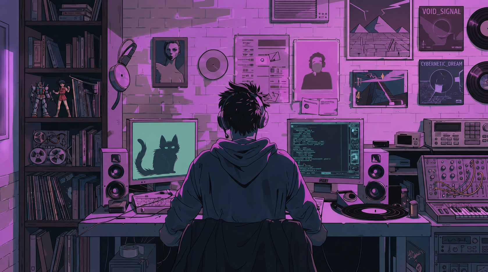

<!-- Banner Image -->

 <h1> 
 the-real-anonymous-codes 🕵️‍♂️ </h1>

  <em>A quiet corner of GitHub for learning Python, one script at a time.</em>

  

### 🌱 About this account

- 🎓 Timepass account — separate from my main profile, kept anonymous on purpose
- 🐍 Currently learning **Python**, building up from the basics
- 🧠 Working through fundamentals: variables, conditionals, loops, functions
- 📓 Notes and mini-projects get pushed here as I go
- 🚫 No personal details on this profile by design — just the code

---

### Plan

| Language | Status |
|---|---|
| `Python` | ✅ Practicing |
| `JAVA` | 🔜 Up next |
| `HTML CS JS` | 🔜 Up next |
| `C` | 🔜 Up next |

---

#### Languages

### Tools

<em>Learning in public, staying anonymous. 👤</em>

